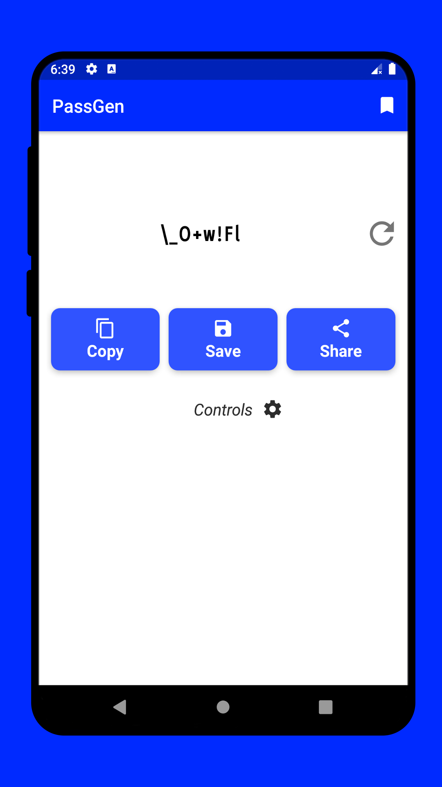
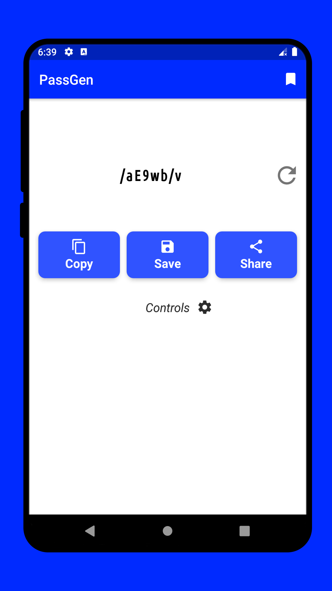
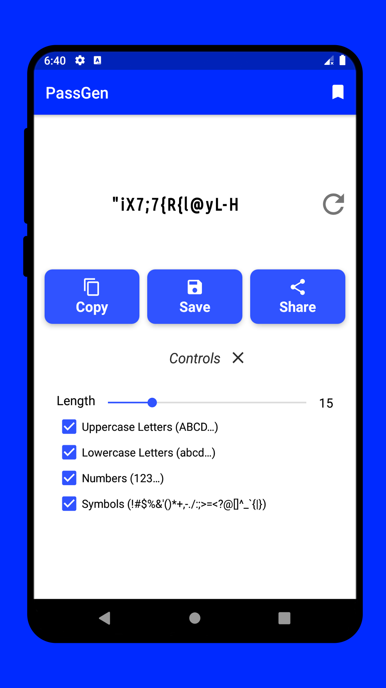
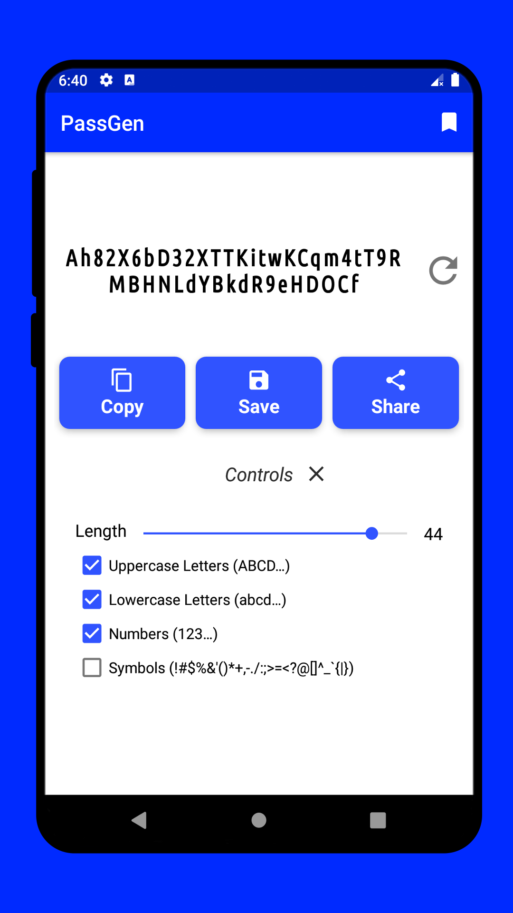
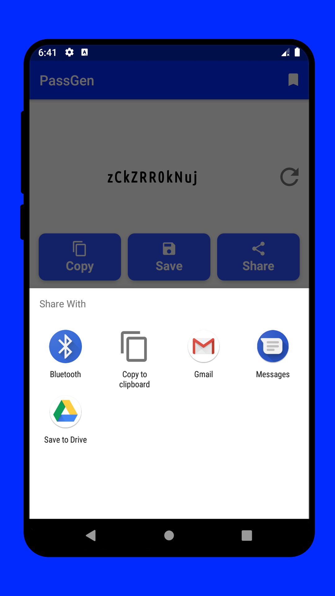
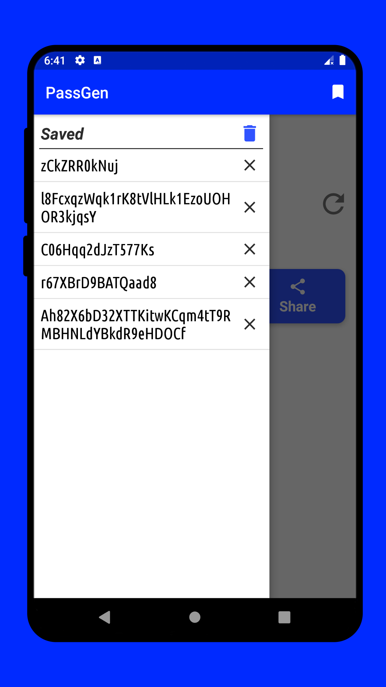

# PassGen

<table>
    <tr>
        <th>Title</th>
        <td> PassGen - Password Generator </td>
    </tr>
    <tr>
        <th>Short description</th>
        <td>Get random string that you can use as passwords.</td>
    </tr>
    <tr>
        <th>Full description</th>
        <td>Generate random passwords. You can include or exclude Uppercase character, lowercase character,
number, and special symbols.

You can copy the password, Save them for later use or directly share from the app to some other apps.
You can manually save passwords for later use.

Change the length of password. You can generate a password of 50 characters too.</td>
    </tr>
    <tr>
        <th>YouTube</th>
        <td>https://youtu.be/eGrJrdRcoOc</td>
    </tr>
</table>

----

#### Screenshots

<table>
    <tr>
        <td></td>
        <td></td>
        <td></td>
    </tr>
    <tr>
        <td></td>
        <td></td>
        <td></td>
    </tr>
</table>
